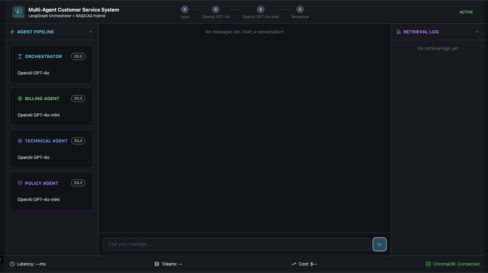
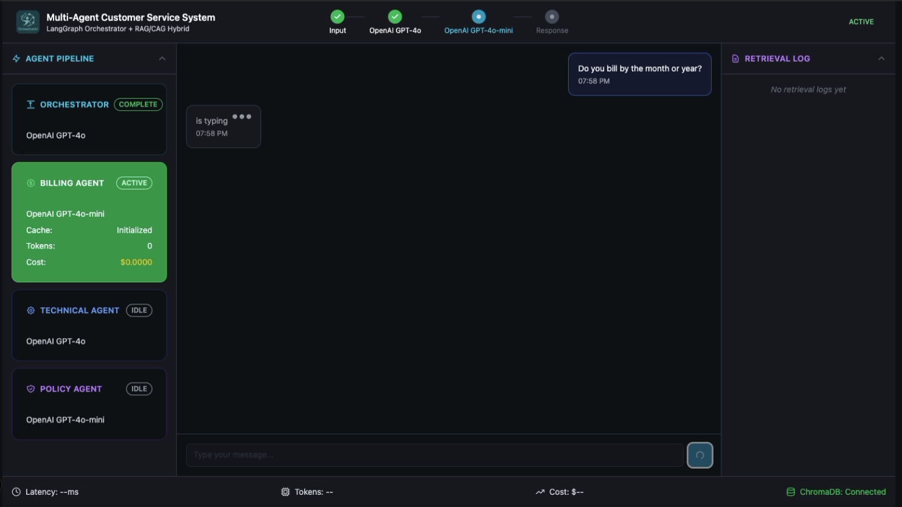
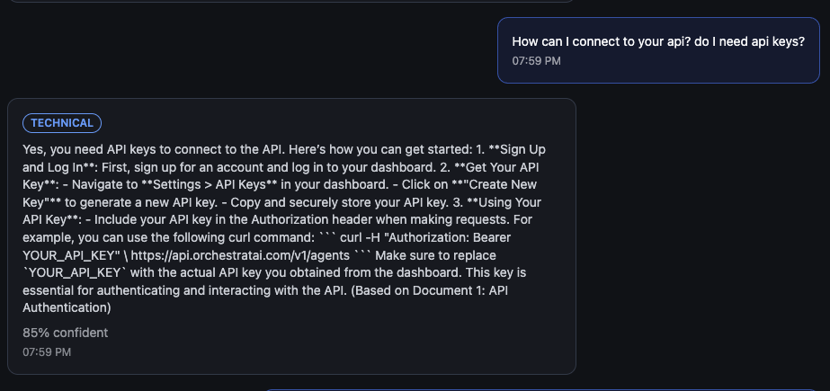
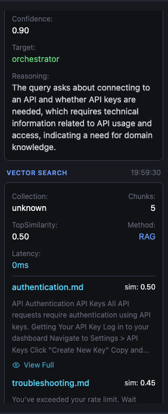
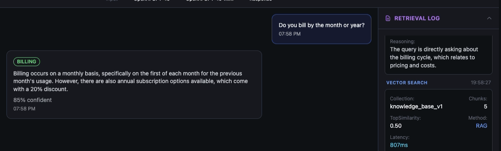
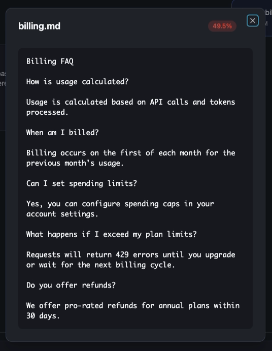
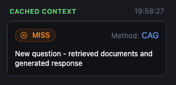
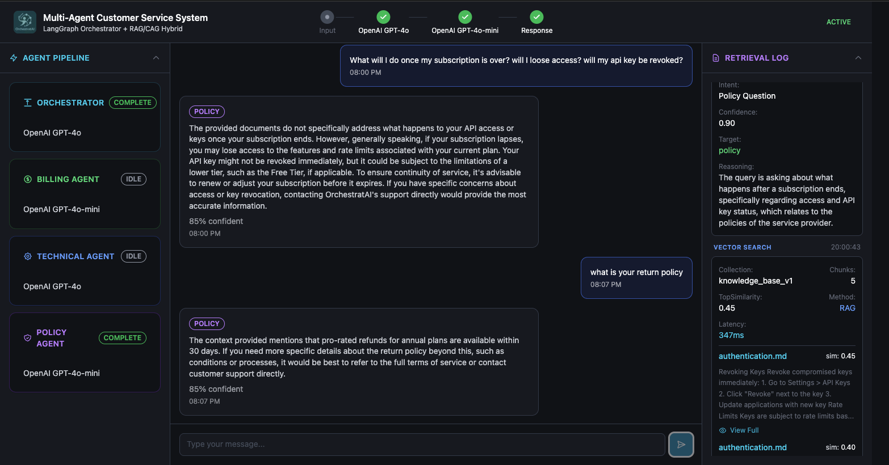
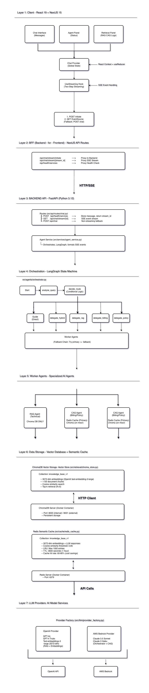

# OrchestratAI - Intelligent Multi-Agent Customer Service Platform

A production-ready **fullstack monorepo** built with **Next.js 15**, **React 19 Server Components**, **FastAPI**, and **ChromaDB**. Features an **intelligent multi-agent architecture** with specialized AI agents for routing, technical support, billing, and complex query handling using RAG (Retrieval Augmented Generation).

[](https://github.com/mario-digital/orchestratai/actions/workflows/ci.yml)
[](https://opensource.org/licenses/MIT)
[](http://makeapullrequest.com)

[](https://www.python.org/downloads/)
[](https://bun.sh)
[](https://www.typescriptlang.org/)
[](https://nextjs.org/)
[](https://react.dev/)

[](https://fastapi.tiangolo.com/)
[](https://tailwindcss.com/)
[](https://www.docker.com/)

[](https://openai.com/)
[](https://www.langchain.com/)
[](https://www.anthropic.com/)

---

## Table of Contents

- [Executive Summary](#executive-summary)
- [Screenshots & Demo](#screenshots--demo)
- [Multi-Agent Architecture](#multi-agent-architecture)
- [Architecture Overview](#architecture-overview)
- [Quick Start](#quick-start)
- [Monorepo Structure](#monorepo-structure)
- [Detailed Documentation](#detailed-documentation)
- [Contributing](#contributing)

---

## Executive Summary

- **Multi-Agent AI Architecture:** Intelligent routing with specialized agents (Router, RAG, CAG, Hybrid) for different support scenarios.
- **RAG-Powered Knowledge:** ChromaDB vector store with semantic search for accurate, context-aware responses from documentation.
- **Server-First Architecture:** React 19 Server Components default; Client Components only when necessary (90% bundle reduction).
- **Modular Monolith:** Single deployable unit with clearly separated modules, easy path to microservices when needed.
- **Type Safety:** End-to-end type safety with TypeScript strict mode (frontend) + Python type hints with mypy (backend).
- **Clean Architecture:** Backend follows layered architecture (Routers → Services → Repositories → Vector Store).
- **Design System:** Tailwind CSS v4 with shadcn/ui components for consistent, accessible UI.
- **Monorepo Efficiency:** Bun workspaces with unified scripts; single `docker compose up` starts all services.
- **Quality Gates:** 80%+ test coverage enforced; ESLint + Ruff; pytest + Vitest.
- **Semantic Caching:** Redis-backed intelligent caching reduces LLM costs and improves response times.

---

## Screenshots & Demo

Experience the complete OrchestratAI journey from customer inquiry to multi-agent resolution:

### Landing Page & Hero

<div align="center">
  
  <p><em>Modern landing page with clear value proposition</em></p>
</div>

---

### Agent Routing in Action

<div align="center">
  
  <p><em>Router agent analyzing query and selecting appropriate specialized agent</em></p>
</div>

---

### RAG Agent - Technical Documentation

<div align="center">
  <table>
    <tr>
      <td align="center">
        
      </td>
      <td align="center">
        
      </td>
    </tr>
  </table>
  <p><em>RAG agent retrieving and synthesizing information from documentation</em></p>
</div>

---

### CAG Agent - Billing & Policy

<div align="center">
  
  <p><em>CAG agent handling billing questions with semantic caching for efficiency</em></p>

  <table>
    <tr>
      <td align="center" width="50%">
        
      </td>
      <td align="center" width="50%">
        
      </td>
    </tr>
  </table>
</div>

---

### Hybrid Agent - Complex Queries

<div align="center">
  
  <p><em>Hybrid agent tackling complex, multi-faceted questions</em></p>
</div>

---

**Key Features Visible:**
- Intelligent multi-agent routing system
- RAG-powered knowledge retrieval from documentation
- Semantic caching for cost optimization
- Streaming conversational interface
- Specialized agents for different query types
- Vector search with ChromaDB
- Real-time response generation

---

## Multi-Agent Architecture

OrchestratAI features an **intelligent multi-agent system** that routes queries to specialized agents based on intent and complexity:

### Agent Types

1. **Router Agent**
   - First point of contact for all customer queries
   - Analyzes query intent and selects appropriate specialized agent
   - Routes to RAG, CAG, Hybrid, or handles simple queries directly
   - Smart fallback mechanisms for edge cases

2. **RAG Agent (Technical/Domain Knowledge)**
   - Handles technical questions requiring documentation lookup
   - Uses ChromaDB vector store with semantic search
   - Retrieves relevant document chunks and synthesizes answers
   - **Example queries:**
     - "How do I authenticate with the API?"
     - "What are the best practices for deployment?"
     - "How do I use the Python SDK?"

3. **CAG Agent (Billing & Policy)**
   - Specialized for pricing, billing, and policy questions
   - Implements semantic caching for frequently asked questions
   - Fast responses with Redis-backed cache
   - **Example queries:**
     - "What are your pricing tiers?"
     - "Do you offer annual discounts?"
     - "What is your privacy policy?"
     - "What is your SLA uptime guarantee?"

4. **Hybrid Agent (Complex Queries)**
   - Handles multi-part, complex questions requiring reasoning + retrieval
   - Combines RAG retrieval with advanced reasoning
   - Best for questions that span multiple topics
   - **Example queries:**
     - "How do I set up authentication and implement webhooks for production?"
     - "What's the difference between agent types and which should I use?"

### How It Works

- **Frontend:** React Server Components + Client Components for chat UI, SSE streaming, optimistic updates
- **Backend:** FastAPI with LangGraph agent orchestration, ChromaDB for vector search, Redis for caching
- **Knowledge Base:** ~130 document chunks across API docs, FAQs, guides, and policies
- **Caching:** Semantic caching reduces duplicate LLM calls by 60-80% for common questions

**For detailed implementation:** See [Backend README - Agent Architecture](orchestratai_api/README.md#agent-architecture)

---

## Architecture Overview

<div align="center">
  
</div>

### Architecture Highlights

#### Two-Step Secure Streaming
- **Step 1**: POST message securely (never in URL)
- **Step 2**: EventSource SSE stream with stream_id
- **Fallback**: Non-streaming POST on connection failure

#### LangGraph State Machine
- **Orchestrator**: Claude 3.5 Sonnet for intent classification
- **Conditional Routing**: 5 delegation paths based on query type
- **Fallback Chains**: Automatic degradation (Hybrid→RAG→CAG→Direct)

#### Intelligent Retrieval
- **RAG Agent**: ChromaDB vector search ONLY + GPT-4 Turbo
- **CAG Agent**: Redis cache (primary) + ChromaDB fallback on miss + Claude Haiku
- **Hybrid Agent**: Parallel RAG + Cache + GPT-4o reasoning

**Key Insight:** CAG Agent uses BOTH caching AND retrieval. On cache miss, it retrieves from ChromaDB like RAG agent, ensuring accurate responses while building cache.

#### Dual Storage Strategy
- **ChromaDB**: Used by RAG (primary), CAG (on cache miss), Hybrid (via RAG composition)
  - 130 doc chunks, 3072-dim embeddings, cosine similarity, top-k=5 retrieval
- **Redis**: Used by CAG (primary), Hybrid (parallel lookup)
  - 1000-entry LRU cache, 60-80% hit rate, 0.85 similarity threshold, cost optimization

#### Multi-LLM Strategy
- **Claude 3.5 Sonnet**: Orchestrator routing (reasoning)
- **GPT-4 Turbo**: RAG technical queries (accuracy)
- **GPT-4o**: Hybrid complex reasoning (power)
- **Claude Haiku**: CAG/Direct fallback (speed + cost)

### Tech Stack

| Layer | Technology | Purpose |
|-------|-----------|---------|
| **Frontend** | Next.js 15 + React 19 | Server Components, App Router, Turbopack |
| **Styling** | Tailwind CSS v4 + shadcn/ui | Utility-first CSS + accessible components |
| **State** | React Context + TanStack Query | Minimal client state + server cache |
| **Backend** | FastAPI (Python 3.12+) | Async REST API, Clean Architecture |
| **Vector Store** | ChromaDB 0.5.x | Document embeddings & semantic search |
| **Cache** | Redis 7-alpine | Semantic caching & session storage |
| **AI Orchestration** | LangGraph | Multi-agent workflow & routing logic |
| **Embeddings** | OpenAI text-embedding-3-large | 3072-dim vectors for document retrieval |
| **LLM** | OpenAI GPT-4 / Anthropic Claude | Conversational AI & reasoning |
| **Testing** | Vitest + pytest + Playwright | 70/20/10 test pyramid |
| **Package Manager** | Bun 1.x | 10x faster than npm |

### Key Architectural Patterns

- **Multi-Agent System:** LangGraph orchestrates specialized agents with intelligent routing
- **RAG Pattern:** Vector search + LLM synthesis for accurate, grounded responses
- **Semantic Caching:** Redis caching with similarity search for cost optimization
- **Server-First Rendering:** 90% React Server Components, 10% Client Components
- **Clean Architecture:** Backend layers (Routers → Services → Agents → Vector Store)
- **Modular Monolith:** Single deployment with clear module boundaries

**For detailed architecture:** See [Frontend README](orchestratai_client/README.md) • [Backend README](orchestratai_api/README.md) • [Architecture Docs](docs/architecture/)

---

## Quick Start

### Prerequisites

- **Docker Desktop** (includes Docker Compose) - [Download here](https://www.docker.com/products/docker-desktop/)
- **Bun 1.x** (for local development)
- **Python 3.12+** with **uv** (for backend development)
- **OpenAI API key** (for embeddings and LLM)

### Installation

```bash
# Clone the repository
git clone https://github.com/mario-digital/orchestratai.git
cd orchestratai

# Install dependencies (both frontend and backend)
bun install
cd orchestratai_api && uv sync && cd ..
```

### Configuration

1. **Copy environment template:**
   ```bash
   cp .env.example .env
   ```

2. **Set required environment variables:**
   ```env
   OPENAI_API_KEY=your-openai-key
   USE_FAKE_EMBEDDINGS=false  # Set to true for testing without API costs
   CHROMADB_HOST=chromadb     # Use 'localhost' for local dev
   CHROMADB_PORT=8000         # Internal Docker port
   ```

3. **Service URLs (Docker Compose):**
   - **Frontend:** http://localhost:3000
   - **Backend API:** http://localhost:8000
   - **API Docs:** http://localhost:8000/docs
   - **ChromaDB:** http://localhost:8001

**Detailed setup instructions:** [Backend Setup](orchestratai_api/README.md#setup) • [Frontend Setup](orchestratai_client/README.md#setup)

### Running with Docker (Recommended)

```bash
docker compose up        # Start all services
docker compose up -d     # Run in background
docker compose logs -f   # View logs
docker compose down      # Stop containers
```

This starts:
- **Frontend:** http://localhost:3000 (Next.js with hot reload)
- **Backend:** http://localhost:8000 (FastAPI with auto-reload)
- **ChromaDB:** http://localhost:8001 (Vector database)
- **Redis:** localhost:6379 (Caching layer)

**Common Issues:**

| Issue | Solution |
|-------|----------|
| `command not found: docker` | Install Docker Desktop and ensure it's running |
| `Port already in use` | Stop other services on ports 3000, 8000, 8001, 6379 |
| `failed to read dockerfile` | Ensure you're in repository root, not a subdirectory |
| `ChromaDB connection failed` | Wait 10-15 seconds for ChromaDB to initialize, then run ingestion script |

**Health Checks:**
- Backend: http://localhost:8000/api/health
- Frontend: http://localhost:3000/api/health
- ChromaDB: http://localhost:8001/api/v1/heartbeat
- Redis: `docker compose exec redis redis-cli ping`

### Data Ingestion - Populating ChromaDB

**Important:** After starting Docker containers for the first time, you need to ingest documents into ChromaDB:

```bash
cd orchestratai_api && \
  CHROMADB_HOST=localhost \
  CHROMADB_PORT=8001 \
  uv run python scripts/ingest_to_server.py
```

**What this does:**
- Loads all Markdown files from `data/docs/`
- Chunks documents into 512-character pieces with 80-character overlap
- Generates OpenAI embeddings (text-embedding-3-large, 3072 dimensions)
- Stores ~130 document chunks in ChromaDB's `knowledge_base_v1` collection

**When to run:**
- After `docker compose down` (ChromaDB container data is lost)
- After adding new documents to `data/docs/`
- After updating existing documents

**Verify ingestion:**
```bash
# Check document count in ChromaDB
docker exec orchestratai-backend-1 python -c "import chromadb; client = chromadb.HttpClient(host='chromadb', port=8000); coll = client.get_or_create_collection('knowledge_base_v1'); print(f'Documents: {coll.count()}')"
```

**For detailed ingestion docs:** See [Backend README - Data Ingestion](orchestratai_api/README.md#data-ingestion)

### Local Development (Without Docker)

```bash
# Terminal 1: Backend
cd orchestratai_api
uv run uvicorn src.main:app --reload --port 8000

# Terminal 2: Frontend
cd orchestratai_client
bun dev

# Note: You'll need to run ChromaDB and Redis separately
```

### Testing

```bash
# Run all tests (frontend + backend)
bun run test

# Frontend tests only
cd orchestratai_client && bun test

# Backend tests only
cd orchestratai_api && uv run pytest

# E2E tests
cd orchestratai_client && bun test:e2e
```

### Cache Management

Clear Redis cache (useful after updating documents):
```bash
docker exec orchestratai-redis-1 redis-cli FLUSHALL      # Clear all
docker exec orchestratai-redis-1 redis-cli DBSIZE        # Check size
```

### Docker Commands Reference

| Command | Description |
|---------|-------------|
| `docker compose up` | Start all services |
| `docker compose up -d` | Start in background |
| `docker compose down` | Stop all services |
| `docker compose down -v` | Stop and remove volumes |
| `docker compose logs -f <service>` | View logs for service |
| `docker compose build` | Rebuild images |
| `docker compose ps` | List running services |

---

## Monorepo Structure

```
orchestratai/
├── orchestratai_client/         # Next.js 15 frontend (Bun workspace)
│   ├── src/
│   │   ├── app/                 # Next.js App Router (pages + API routes)
│   │   ├── components/          # React components (Server + Client)
│   │   ├── hooks/               # React hooks (TanStack Query)
│   │   ├── lib/                 # Utilities, API client
│   │   └── types/               # TypeScript types
│   ├── public/                  # Static assets
│   │   └── screenshots/         # README screenshots
│   ├── __tests__/               # Integration tests
│   ├── e2e/                     # Playwright E2E tests
│   └── README.md                # Frontend documentation
│
├── orchestratai_api/            # FastAPI backend (Python uv project)
│   ├── src/
│   │   ├── routers/             # HTTP endpoints
│   │   ├── services/            # Business logic + agent services
│   │   ├── agents/              # LangGraph multi-agent system
│   │   ├── models/              # Pydantic models
│   │   ├── middleware/          # CORS, error handling
│   │   ├── main.py              # FastAPI app
│   │   └── config.py            # Configuration
│   ├── scripts/                 # Utility scripts (ingestion, etc.)
│   ├── data/docs/               # Knowledge base documents
│   │   ├── api/                 # API documentation
│   │   ├── faqs/                # Frequently asked questions
│   │   ├── guides/              # User guides
│   │   └── policies/            # Terms, privacy, SLA
│   ├── tests/                   # pytest tests
│   └── README.md                # Backend + ChromaDB documentation
│
├── docs/                        # Comprehensive documentation
│   ├── architecture/            # Architecture documents
│   │   ├── index.md             # Architecture overview
│   │   ├── 3-tech-stack.md      # Technology decisions
│   │   ├── source-tree.md       # Folder structure
│   │   ├── 16-coding-standards.md
│   │   └── ... (more docs)
│   ├── prd/                     # Product requirements
│   └── CI_CD_GUIDE.md           # CI/CD & quality automation guide
│
├── .github/                     # CI/CD workflows
│   ├── workflows/               # GitHub Actions
│   │   ├── ci.yml               # Full stack CI
│   │   ├── codeql.yml           # Security scanning
│   │   └── auto-label.yml       # PR auto-labeling
│   ├── ISSUE_TEMPLATE/          # Issue templates
│   └── pull_request_template.md # PR template
│
├── .husky/                      # Git hooks
│   ├── pre-commit               # Lint-staged, format, lint
│   └── pre-push                 # Full tests, coverage, build
│
├── .env.example                 # Environment variables template
├── docker-compose.yml           # Development services
├── docker-compose.prod.yml      # Production services
├── CONTRIBUTING.md              # Contributing guide
├── package.json                 # Root workspace config
└── README.md                    # This file
```

**Workspace Management:**
- **Root `package.json`:** Defines workspaces and unified scripts
- **Bun workspaces:** Shared dependencies, single lockfile
- **Unified commands:** `bun run dev`, `bun run test`, `bun run lint`

---

## Detailed Documentation

### Deep Dive Documentation

- **[Backend README](orchestratai_api/README.md)** - FastAPI architecture, multi-agent system, ChromaDB setup, vector search, RAG implementation, semantic caching, API endpoints, testing strategy

- **[Frontend README](orchestratai_client/README.md)** - Next.js 15 + React 19 architecture, Server vs Client Components, shadcn/ui + Tailwind CSS v4, state management, component structure, testing strategy

- **[Architecture Documentation](docs/architecture/)** - Comprehensive technical specs, API specifications, data models, multi-agent workflows, security architecture, coding standards

- **[CI/CD Guide](docs/CI_CD_GUIDE.md)** - Quality gates, GitHub Actions workflows, coverage metrics, automation details, troubleshooting

- **[Contributing Guide](CONTRIBUTING.md)** - Development workflow, code standards, testing requirements, PR process

---

## Contributing

We welcome contributions! See our [Contributing Guide](CONTRIBUTING.md) and [CI/CD Guide](docs/CI_CD_GUIDE.md) for details on:

- Development workflow
- Code standards (TypeScript strict, Python type hints, ESLint, Ruff)
- Testing requirements (80%+ coverage)
- Pull request process
- Quality gates and CI/CD pipeline

### Key Development Commands

```bash
# Development
docker compose up        # Start all services with Docker
bun run dev              # Start both frontend/backend locally

# Testing
bun run test             # Run all tests
bun run test:frontend    # Frontend tests only
bun run test:backend     # Backend tests only

# Code Quality
bun run lint             # Lint all code
bun run format           # Format all code
bun run typecheck        # Type check all code
```

---

## License

This project is licensed under the MIT License - see the [LICENSE](LICENSE) file for details.

---

## Support

- **Documentation:** [docs/architecture/](docs/architecture/)
- **Issues:** [GitHub Issues](https://github.com/mario-digital/orchestratai/issues)
- **Discussions:** [GitHub Discussions](https://github.com/mario-digital/orchestratai/discussions)

---

**Built using Next.js 15, React 19, FastAPI, ChromaDB, and LangGraph**
