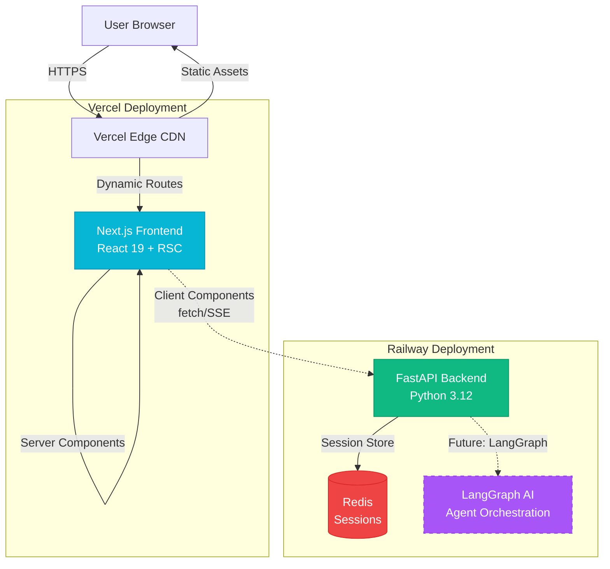
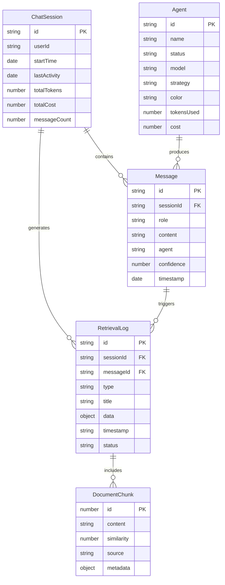
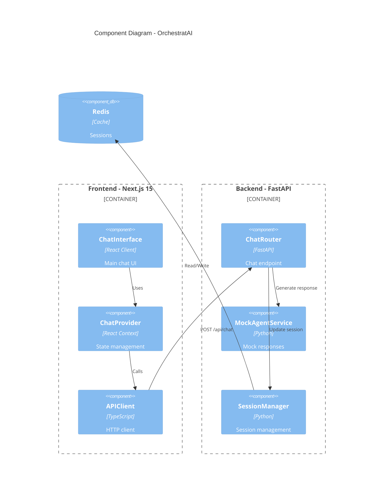
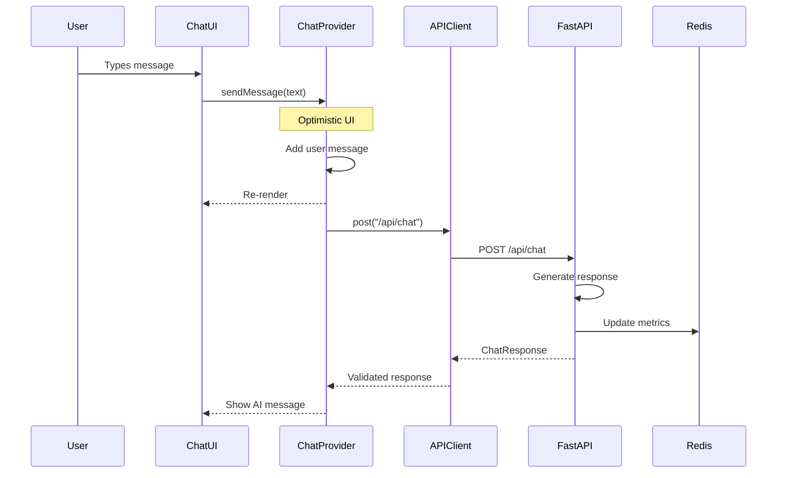
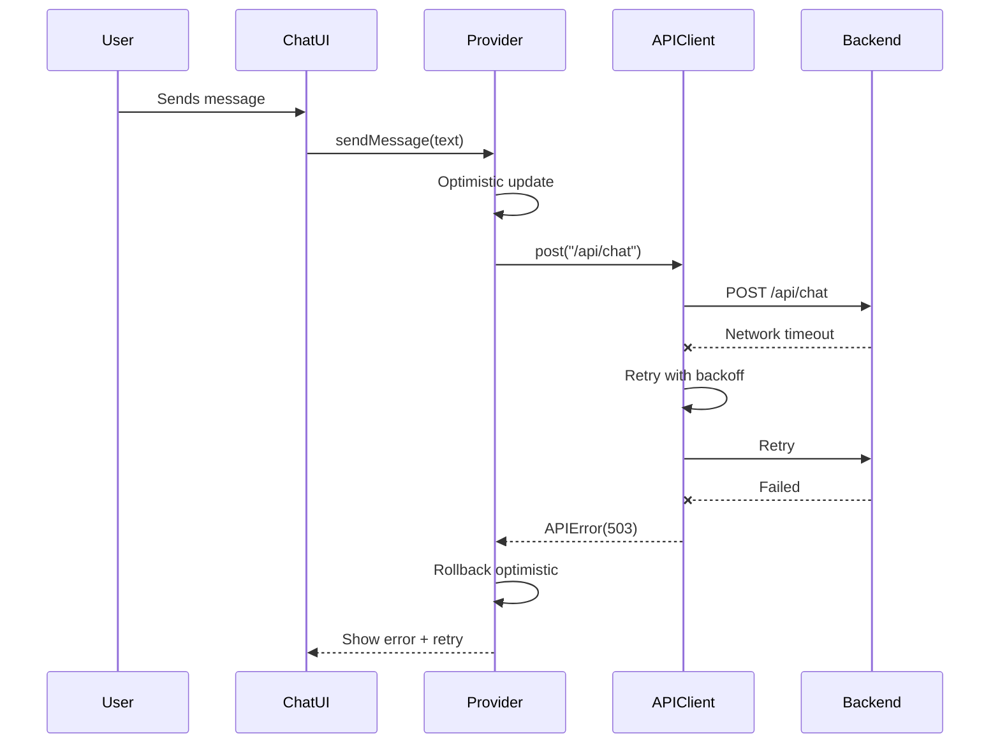

# OrchestratAI - Fullstack Architecture Document

**Project Name**: OrchestratAI
**Version**: 1.0.0
**Last Updated**: October 24, 2025
**Document Type**: Fullstack Architecture Specification
**Repository**: https://github.com/mario-digital/OrchestratAI
**Status**: ✅ Ready for Implementation

---

## Change Log

| Date | Version | Description | Author |
|------|---------|-------------|--------|
| 2025-10-24 | 1.0.0 | Initial architecture document created | Winston (Architect Agent) |

---

## Table of Contents

1. [Introduction](#1-introduction)
2. [High Level Architecture](#2-high-level-architecture)
3. [Tech Stack](#3-tech-stack)
4. [Data Models](#4-data-models)
5. [API Specification](#5-api-specification)
6. [Components](#6-components)
7. [Core Workflows](#7-core-workflows)
8. [Database Schema](#8-database-schema)
9. [Frontend Architecture](#9-frontend-architecture)
10. [Backend Architecture](#10-backend-architecture)
11. [Unified Project Structure](#11-unified-project-structure)
12. [Development Workflow](#12-development-workflow)
13. [Deployment Architecture](#13-deployment-architecture)
14. [Security and Performance](#14-security-and-performance)
15. [Testing Strategy](#15-testing-strategy)
16. [Coding Standards](#16-coding-standards)
17. [Error Handling Strategy](#17-error-handling-strategy)
18. [Monitoring and Observability](#18-monitoring-and-observability)

---

## 1. Introduction

### 1.1 Starter Template or Existing Project

**Status:** Partially Bootstrapped Project

OrchestratAI is built on an existing foundation with the following components already in place:

✅ **Infrastructure:**
- Docker + Docker Compose (development & production)
- Bun monorepo workspace structure
- Next.js 15 + React 19 frontend (`orchestratai_client/`)
- FastAPI + Python 3.12 backend (`orchestratai_api/`)
- ESLint 9, Prettier, Vitest, Husky pre-configured

❌ **NOT using a complete fullstack starter template** (e.g., T3 Stack, create-t3-app)

**Architectural Constraints:**
1. **Monorepo structure is fixed** - Must maintain `orchestratai_client/` and `orchestratai_api/` separation
2. **Package managers are fixed** - Bun (frontend), uv (backend)
3. **Docker-first development** - All development through containers
4. **Tailwind CSS v4** - Already configured with custom token system
5. **Next.js App Router** - Using React Server Components First approach

**What CAN be modified:**
- Internal directory structure within `src/` folders
- Additional shared packages in `packages/`
- Testing frameworks and tooling
- CI/CD pipeline configuration
- Deployment targets

**Recommendation:** Proceed with architecture design within these constraints. The existing setup follows modern best practices and should be enhanced rather than replaced.

---

### 1.2 Document Purpose

This document outlines the complete fullstack architecture for **OrchestratAI**, including backend systems, frontend implementation, and their integration. It serves as the single source of truth for AI-driven development, ensuring consistency across the entire technology stack.

This unified approach combines what would traditionally be separate backend and frontend architecture documents, streamlining the development process for a modern fullstack application where these concerns are increasingly intertwined.

**Key Goals:**
- Provide detailed technical guidance for implementing PRD v2.0
- Define integration patterns between Next.js frontend and FastAPI backend
- Establish data models shared between frontend (TypeScript) and backend (Python)
- Specify API contracts and communication protocols
- Guide Docker-based development and deployment workflows

---

## 2. High Level Architecture

### 2.1 Technical Summary

OrchestratAI implements a **modern modular monolith architecture** deployed via Docker containers, featuring a Next.js 15 frontend with React Server Components and a FastAPI Python backend with modular service organization.

The system uses a **Server Components First** approach where initial page loads are server-rendered with subsequent interactions handled by client components, communicating with the backend through a type-safe API layer validated by Zod (frontend) and Pydantic (backend). The frontend and backend share a unified type system through synchronized TypeScript and Python enums, enforced by automated validation scripts in the CI/CD pipeline.

Infrastructure runs on **Docker Compose** for development with service networking between frontend (`orchestratai_client`), backend (`orchestratai_api`), and Redis containers, using Bun workspaces for monorepo management and enabling shared TypeScript types in a `packages/shared` directory.

The architecture demonstrates **production-ready design patterns** including a 3-layer CSS design token system (following the my_flow_app reference pattern), optimistic UI updates, and modular backend organization that's prepared for future LangGraph AI agent orchestration while currently using mock data for rapid MVP development.

---

### 2.2 Platform and Infrastructure Choice

**Platform:** Vercel (Frontend) + Railway (Backend) ⭐ **RECOMMENDED**

**Rationale:**
1. **Portfolio Focus**: Vercel deployment demonstrates modern Next.js best practices
2. **Speed**: Fastest time-to-deployment (< 1 hour setup)
3. **Developer Experience**: Automatic preview deployments for demos
4. **Cost**: Free tier perfect for portfolio/demo
5. **Scalability Path**: Easy upgrade when needed

**Platform Configuration:**

```yaml
Platform: Vercel (Frontend) + Railway (Backend)

Frontend Services:
  - Vercel Edge Network (global CDN)
  - Automatic HTTPS
  - Environment: Node.js 20+

Backend Services:
  - Railway Docker deployment
  - PostgreSQL addon (if needed later)
  - Redis addon (session management)

Deployment Regions:
  - Vercel: Global edge (automatic)
  - Railway: US-West (Oregon) or EU-West (Frankfurt)
```

**Key Services:**
- Vercel Edge CDN (global distribution)
- Railway Docker runtime (FastAPI backend)
- Railway Redis (session/cache storage)
- Railway PostgreSQL (future - persistent storage)

---

### 2.3 Repository Structure

**Structure:** Bun Workspaces Monorepo
**Monorepo Tool:** Bun native workspaces
**Package Organization:**

```yaml
Packages:
  - orchestratai_client: Next.js frontend application
  - orchestratai_api: FastAPI backend application
  - packages/shared: Shared TypeScript types/enums (TO CREATE)
  - packages/ui: Shared React components (OPTIONAL - Phase 5+)

Shared Code Strategy:
  - TypeScript types/interfaces → packages/shared/src/types/
  - Enums → packages/shared/src/enums/
  - Constants → packages/shared/src/constants/
  - Utils (if truly shared) → packages/shared/src/utils/
```

**Rationale:**
- Frontend imports from `@orchestratai/shared`
- Backend uses enum validation script to stay synchronized
- No code duplication for domain models
- Clear separation of concerns

---

### 2.4 High Level Architecture Diagram



---

### 2.5 Architectural Patterns

**Patterns guiding fullstack development:**

- **Jamstack Architecture:** Server-rendered Next.js with API routes and serverless edge functions - _Rationale:_ Optimal performance with Server Components for initial loads and client-side hydration for interactivity

- **Server Components First:** Default to React Server Components, use Client Components only when necessary (state, events, browser APIs) - _Rationale:_ Reduced bundle size, faster initial page loads, better SEO, aligns with Next.js 15 best practices

- **Modular Monolith (Backend):** Organized into `agents/`, `models/`, `services/` modules within single deployment - _Rationale:_ Simplicity of single deployment with architectural benefits of separation; ready for microservices extraction if needed

- **Backend for Frontend (BFF):** FastAPI serves as dedicated backend for Next.js frontend needs - _Rationale:_ Tailored API responses, handles aggregation and transformation specific to UI requirements

- **Type-Safe Contract:** Shared enums + Zod (FE) + Pydantic (BE) with automated synchronization - _Rationale:_ Compile-time and runtime type safety prevents API contract drift

- **Repository Pattern (Backend):** Abstract data access behind repository interfaces - _Rationale:_ Enables testing with mocks, future database changes, follows SOLID principles

- **Optimistic UI Updates:** Frontend shows immediate feedback before API confirmation - _Rationale:_ Perceived performance improvement, better UX during network latency

- **Three-Layer Design Tokens:** Primitives → Semantic → Component tokens in CSS - _Rationale:_ Consistent theming, maintainable styling, proven pattern from my_flow_app reference

- **Docker-First Development:** All development through containers with hot reload - _Rationale:_ Environment consistency, eliminates "works on my machine" issues

---

## 3. Tech Stack

This is the **DEFINITIVE** technology selection for OrchestratAI. All development must use these exact versions and tools.

### Technology Stack Table

| Category | Technology | Version | Purpose | Rationale |
|----------|-----------|---------|---------|-----------|
| **Frontend Language** | TypeScript | 5.6+ | Type-safe JavaScript for frontend | Industry standard, excellent IDE support, catches errors at compile-time |
| **Frontend Framework** | Next.js | 15.5 | React meta-framework with SSR/SSG | Latest stable, App Router, React Server Components, Turbopack, server actions |
| **React** | React | 19.2 | UI library | Latest stable, React Compiler, Actions API, enhanced Suspense |
| **UI Component Library** | shadcn/ui | 3.5.0 | Accessible component primitives | Radix UI based, fully customizable, copy-paste approach, Tailwind compatible |
| **CSS Framework** | Tailwind CSS | 4.0 | Utility-first styling | Latest v4, 3-layer token system, proven in my_flow_app, optimal DX |
| **State Management** | React Context + TanStack Query | React 19 + v5 | Client state + server cache | Server Components reduce client state needs, TanStack for API caching (Phase 5) |
| **Icons** | Lucide React | Latest | Icon library | Consistent with shadcn/ui, tree-shakeable, modern design |
| **Runtime Validation** | Zod | 3.23+ | Schema validation | Type inference, runtime safety, API contract validation |
| **Backend Language** | Python | 3.12 | Backend programming language | Latest stable, excellent AI/ML libraries for future LangGraph integration |
| **Backend Framework** | FastAPI | 0.115+ | Modern Python web framework | Auto OpenAPI docs, async support, Pydantic validation, fast performance |
| **Package Manager (BE)** | uv | Latest | Python package manager | 10-100x faster than pip, modern replacement, excellent DX |
| **API Style** | REST JSON | OpenAPI 3.0 | HTTP API protocol | Simple, well-understood, auto-documented via FastAPI, sufficient for MVP |
| **Database** | PostgreSQL (Future) / Mock (MVP) | 16+ / N/A | Relational database | Industry standard, Railway addon when ready, MVP uses mocks |
| **Cache** | Redis | 7-alpine | Session store & caching | Fast in-memory store, configured in docker-compose |
| **File Storage** | Local/S3 (Future) | N/A | Static asset storage | MVP uses local, migrate to S3 when deploying |
| **Authentication** | Custom JWT (MVP) / NextAuth.js (Future) | N/A / v5 | User authentication | MVP skip auth, add NextAuth.js when needed |
| **Frontend Testing** | Vitest | Latest | Unit/integration testing | Fast, Vite-based, already configured |
| **Backend Testing** | pytest | 8.0+ | Python testing framework | Industry standard, already configured |
| **E2E Testing** | Playwright | 1.55+ | Browser automation | Cross-browser support, excellent DX |
| **Package Manager (FE)** | Bun | 1.1+ | JavaScript runtime & package manager | 10x faster than npm, native TypeScript support |
| **Build Tool** | Next.js (FE) / Docker (BE) | 15.5 / 27+ | Build systems | Next.js handles frontend, Docker multi-stage for backend |
| **Bundler** | Turbopack | Beta (Next.js 15) | JavaScript bundler | Faster than Webpack, native to Next.js 15 |
| **IaC Tool** | Docker Compose | 2.29+ | Infrastructure definition | Simple, already configured |
| **CI/CD** | GitHub Actions | N/A | Continuous integration | Free for public repos |
| **Monitoring** | Vercel Analytics / Railway Logs | Platform native | Performance monitoring | Built-in to platforms |
| **Logging** | Console (MVP) / Structured (Future) | N/A / Pino | Application logging | Migrate to structured logging later |
| **Linting** | ESLint | 9.x | Code quality | Latest flat config, custom rules |
| **Formatting** | Prettier | Latest | Code formatting | Consistent style |
| **Git Hooks** | Husky | 9.1+ | Pre-commit automation | Runs enum validation and linting |

---

## 4. Data Models

Core data models shared between frontend (TypeScript) and backend (Python):

### 4.1 Agent

**Purpose:** Represents an AI agent in the multi-agent orchestration system

**TypeScript Interface:**
```typescript
// packages/shared/src/types/agent.ts
import { AgentId, AgentStatus, RetrievalStrategy, AgentColor } from '../enums';

export interface Agent {
  id: AgentId;
  name: string;
  status: AgentStatus;
  model: string;
  strategy?: RetrievalStrategy;
  color: AgentColor;
  tokensUsed: number;
  cost: number;
  cached?: boolean;
}
```

**Relationships:**
- An Agent produces Messages
- An Agent generates RetrievalLogs during processing
- Multiple Agents exist per ChatSession

---

### 4.2 Message

**Purpose:** Represents a single message in the chat conversation

**TypeScript Interface:**
```typescript
// packages/shared/src/types/message.ts
import { MessageRole, AgentId } from '../enums';

export interface Message {
  id: string; // UUID
  role: MessageRole;
  content: string;
  agent?: AgentId;
  confidence?: number; // 0.0 to 1.0
  timestamp: Date;
  sessionId: string; // UUID
}
```

**Relationships:**
- Messages belong to a ChatSession
- Assistant Messages reference an Agent
- Messages trigger RetrievalLogs

---

### 4.3 RetrievalLog

**Purpose:** Captures detailed logging of agent processing steps

**TypeScript Interface:**
```typescript
// packages/shared/src/types/retrieval-log.ts
import { LogType, LogStatus } from '../enums';
import { DocumentChunk } from './document-chunk';

export interface RetrievalLog {
  id: string; // UUID
  type: LogType;
  title: string;
  data: Record<string, any>;
  timestamp: string; // ISO 8601
  status: LogStatus;
  chunks?: DocumentChunk[];
  sessionId: string;
  messageId: string;
}
```

**Relationships:**
- RetrievalLogs belong to a ChatSession
- RetrievalLogs are triggered by a Message
- RetrievalLogs can contain DocumentChunks

---

### 4.4 DocumentChunk

**Purpose:** Represents a retrieved document fragment from vector search

**TypeScript Interface:**
```typescript
// packages/shared/src/types/document-chunk.ts
export interface DocumentChunk {
  id: number;
  content: string;
  similarity: number; // 0.0 to 1.0
  source: string;
  metadata?: Record<string, any>;
}
```

---

### 4.5 ChatSession

**Purpose:** Represents a user's conversation session

**TypeScript Interface:**
```typescript
// packages/shared/src/types/chat-session.ts
export interface ChatSession {
  id: string; // UUID
  userId?: string;
  startTime: Date;
  lastActivity: Date;
  totalTokens: number;
  totalCost: number;
  messageCount: number;
}
```

---

### 4.6 ChatMetrics

**Purpose:** Real-time metrics for a single chat interaction

**TypeScript Interface:**
```typescript
// packages/shared/src/types/chat-metrics.ts
export interface ChatMetrics {
  tokensUsed: number;
  cost: number; // USD
  latency: number; // milliseconds
}
```

---

### Data Model Relationships Diagram



---

## 5. API Specification

Complete OpenAPI 3.0 specification for OrchestratAI REST API.

### REST API Specification

```yaml
openapi: 3.0.0
info:
  title: OrchestratAI API
  version: 1.0.0
  description: |
    Backend API for OrchestratAI multi-agent customer service system.

    Features:
    - Multi-agent chat orchestration
    - Real-time retrieval logging
    - Session management with Redis
    - Type-safe contracts validated with Pydantic

servers:
  - url: http://localhost:8000
    description: Local development
  - url: https://orchestratai-api.railway.app
    description: Production (Railway)

paths:
  /api/health:
    get:
      summary: Health check
      tags: [health]
      responses:
        '200':
          description: API is healthy
          content:
            application/json:
              schema:
                type: object
                properties:
                  status:
                    type: string
                    enum: [healthy]
                  version:
                    type: string
                  timestamp:
                    type: string
                    format: date-time

  /api/chat:
    post:
      summary: Send chat message
      tags: [chat]
      requestBody:
        required: true
        content:
          application/json:
            schema:
              $ref: '#/components/schemas/ChatRequest'
      responses:
        '200':
          description: Successful response
          content:
            application/json:
              schema:
                $ref: '#/components/schemas/ChatResponse'
        '400':
          description: Validation error
          content:
            application/json:
              schema:
                $ref: '#/components/schemas/ErrorResponse'

  /api/session:
    post:
      summary: Create new session
      tags: [session]
      responses:
        '201':
          description: Session created
          content:
            application/json:
              schema:
                type: object
                properties:
                  session_id:
                    type: string
                    format: uuid
                  created_at:
                    type: string
                    format: date-time

components:
  schemas:
    ChatRequest:
      type: object
      required:
        - message
        - session_id
      properties:
        message:
          type: string
          minLength: 1
          maxLength: 2000
        session_id:
          type: string
          format: uuid

    ChatResponse:
      type: object
      required:
        - message
        - agent
        - confidence
        - logs
        - metrics
      properties:
        message:
          type: string
        agent:
          $ref: '#/components/schemas/AgentId'
        confidence:
          type: number
          minimum: 0.0
          maximum: 1.0
        logs:
          type: array
          items:
            $ref: '#/components/schemas/RetrievalLog'
        metrics:
          $ref: '#/components/schemas/ChatMetrics'

    ErrorResponse:
      type: object
      required:
        - error
      properties:
        error:
          type: object
          properties:
            code:
              type: string
            message:
              type: string
            timestamp:
              type: string
              format: date-time
            requestId:
              type: string

    AgentId:
      type: string
      enum: [orchestrator, billing, technical, policy]

    LogType:
      type: string
      enum: [routing, vector_search, cache, documents]

    LogStatus:
      type: string
      enum: [success, warning, error]
```

---

## 6. Components

Major logical components across the fullstack system:

### 6.1 Frontend Components

#### ChatInterface
**Responsibility:** Main chat UI orchestrator
**Technology:** React Client Component
**Dependencies:** ChatProvider, APIClient, child UI components

#### AgentPanel
**Responsibility:** Display real-time agent statuses
**Technology:** React Component (Server/Client hybrid)
**Dependencies:** ChatProvider, AgentCard components

#### RetrievalPanel
**Responsibility:** Display retrieval logs with filtering
**Technology:** React Client Component
**Dependencies:** ChatProvider, LogCard components

#### ChatProvider
**Responsibility:** Global state management for chat
**Technology:** React Context + useReducer
**Dependencies:** APIClient, localStorage

#### APIClient
**Responsibility:** Type-safe HTTP client
**Technology:** TypeScript Class
**Dependencies:** Zod schemas, custom errors

---

### 6.2 Backend Components

#### ChatRouter
**Responsibility:** FastAPI router for `/api/chat`
**Technology:** FastAPI APIRouter
**Dependencies:** MockAgentService, Pydantic schemas

#### MockAgentService
**Responsibility:** Generate mock responses (MVP)
**Technology:** Pure Python functions
**Dependencies:** None

#### SessionManager
**Responsibility:** Redis session management
**Technology:** Python class with redis-py
**Dependencies:** Redis client

---

### Component Interaction Diagram



---

## 7. Core Workflows

Key system workflows illustrated with sequence diagrams.

### 7.1 Send Message - Happy Path



---

### 7.2 Error Handling - Network Failure



---

## 8. Database Schema

### 8.1 MVP Approach: Redis-Only

OrchestratAI MVP uses **Redis exclusively** for session storage. No PostgreSQL needed yet.

**Redis Session Storage:**

```redis
# Key: session:{uuid}
# Type: Hash
# TTL: 86400 seconds (24 hours)

HSET session:550e8400-...
  id "550e8400-..."
  start_time "2025-10-24T14:30:00Z"
  total_tokens "1243"
  total_cost "0.0034"
  message_count "2"
```

---

### 8.2 Future PostgreSQL Schema (Phase 4+)

```sql
CREATE TABLE sessions (
    id UUID PRIMARY KEY,
    user_id UUID REFERENCES users(id),
    start_time TIMESTAMP NOT NULL,
    last_activity TIMESTAMP NOT NULL,
    total_tokens INTEGER DEFAULT 0,
    total_cost DECIMAL(10, 6) DEFAULT 0.0,
    message_count INTEGER DEFAULT 0
);

CREATE TABLE messages (
    id UUID PRIMARY KEY,
    session_id UUID REFERENCES sessions(id),
    role VARCHAR(20) NOT NULL,
    content TEXT NOT NULL,
    agent VARCHAR(50),
    confidence DECIMAL(3, 2),
    created_at TIMESTAMP NOT NULL
);

CREATE TABLE retrieval_logs (
    id UUID PRIMARY KEY,
    session_id UUID REFERENCES sessions(id),
    message_id UUID REFERENCES messages(id),
    type VARCHAR(50) NOT NULL,
    title VARCHAR(255) NOT NULL,
    data JSONB NOT NULL,
    created_at TIMESTAMP NOT NULL,
    status VARCHAR(20) NOT NULL
);
```

---

## 9. Frontend Architecture

### 9.1 Component Organization

```
orchestratai_client/src/
├── components/
│   ├── ui/              # shadcn/ui primitives
│   ├── chat/            # Chat components
│   ├── panels/          # Side panels
│   ├── layout/          # Layout components
│   └── providers/       # Context providers
├── lib/
│   ├── api-client.ts    # HTTP client
│   ├── api/chat.ts      # Chat API
│   ├── errors.ts        # Error classes
│   └── utils.ts         # Utilities
└── hooks/
    ├── use-chat.ts      # Chat logic
    └── use-mobile.ts    # Mobile detection
```

---

### 9.2 State Management

**Pattern:** React Context + useReducer

```typescript
// providers/chat-provider.tsx
'use client';

const ChatContext = createContext<ChatContextValue | null>(null);

export function ChatProvider({ children, initialAgents }: Props) {
  const [state, dispatch] = useReducer(chatReducer, initialState);

  const sendMessage = async (text: string) => {
    dispatch({ type: 'SET_PROCESSING', payload: true });

    const result = await sendMessageSafe(text, state.sessionId);

    if (result.success) {
      dispatch({ type: 'ADD_MESSAGE', payload: result.data });
    }

    dispatch({ type: 'SET_PROCESSING', payload: false });
  };

  return (
    <ChatContext.Provider value={{ state, sendMessage }}>
      {children}
    </ChatContext.Provider>
  );
}
```

---

### 9.3 API Client

```typescript
// lib/api-client.ts
export class APIClient {
  private baseUrl = process.env.NEXT_PUBLIC_API_URL!;

  async request<T>(endpoint: string, options: RequestInit): Promise<T> {
    const response = await fetch(`${this.baseUrl}${endpoint}`, options);

    if (!response.ok) {
      throw new APIError(response.status, await response.text());
    }

    return response.json();
  }

  async post<T>(endpoint: string, data: unknown): Promise<T> {
    return this.request<T>(endpoint, {
      method: 'POST',
      body: JSON.stringify(data),
      headers: { 'Content-Type': 'application/json' },
    });
  }
}
```

---

## 10. Backend Architecture

### 10.1 Service Organization

```
orchestratai_api/src/
├── api/routes/          # FastAPI routers
│   ├── health.py
│   ├── chat.py
│   └── session.py
├── agents/              # Agent modules (loosely coupled)
│   ├── __init__.py
│   ├── base_agent.py         # Abstract base class
│   ├── orchestrator.py       # Router agent
│   ├── billing_agent.py      # Billing support
│   ├── technical_agent.py    # Technical support
│   └── policy_agent.py       # Policy & compliance
├── services/            # Business logic
│   ├── mock_data.py
│   └── session_manager.py
├── models/              # Pydantic models
│   ├── enums.py         # Mirror frontend!
│   └── schemas.py
├── middleware/          # Middleware
│   ├── error_handler.py
│   └── logging.py
└── main.py              # App entry
```

---

### 10.2 Controller Pattern

```python
# api/routes/chat.py
from fastapi import APIRouter
from src.models.schemas import ChatRequest, ChatResponse
from src.services.mock_data import generate_mock_response

router = APIRouter(prefix="/api", tags=["chat"])

@router.post("/chat", response_model=ChatResponse)
async def chat(request: ChatRequest) -> ChatResponse:
    """Process chat message"""
    response = generate_mock_response(request.message)
    return response
```

---

## 11. Unified Project Structure

```
orchestratai/                          # Monorepo root
├── orchestratai_client/               # Frontend
│   ├── src/
│   │   ├── app/                       # Next.js App Router
│   │   ├── components/                # React components
│   │   ├── lib/                       # Utilities
│   │   └── hooks/                     # Custom hooks
│   ├── public/                        # Static assets
│   ├── next.config.ts
│   ├── tailwind.config.ts
│   └── package.json
│
├── orchestratai_api/                  # Backend
│   ├── src/
│   │   ├── api/routes/
│   │   ├── agents/                    # Agent modules (loosely coupled)
│   │   │   ├── __init__.py
│   │   │   ├── base_agent.py         # Abstract base
│   │   │   ├── orchestrator.py       # Router agent
│   │   │   ├── billing_agent.py      # Billing support
│   │   │   ├── technical_agent.py    # Technical support
│   │   │   └── policy_agent.py       # Policy & compliance
│   │   ├── services/
│   │   ├── models/
│   │   └── main.py
│   ├── tests/
│   └── pyproject.toml
│
├── packages/shared/                   # Shared types
│   ├── src/
│   │   ├── types/
│   │   ├── enums/
│   │   └── schemas/
│   └── package.json
│
├── scripts/
│   └── validate-enums.ts              # Enum validator
│
├── docs/
│   ├── prd/
│   └── architecture.md                # This document
│
├── docker-compose.yml
├── package.json                       # Workspace root
└── README.md
```

---

## 12. Development Workflow

### 12.1 Prerequisites

```bash
# Required
- Docker Desktop 27+
- Bun 1.1+
- uv (Python package manager)
- Git
```

---

### 12.2 Local Setup

```bash
# Clone repository
git clone https://github.com/mario-digital/OrchestratAI.git
cd OrchestratAI

# Start all services
docker compose up

# View logs
docker compose logs -f
```

---

### 12.3 Development Commands

```bash
# Start all (frontend + backend + Redis)
docker compose up

# Run tests
bun run test

# Validate enums
bun run validate:enums

# Lint
bun run lint

# Format
bun run format
```

---

### 12.4 Environment Variables

```bash
# Frontend (.env.local)
NEXT_PUBLIC_API_URL=http://localhost:8000
NEXT_PUBLIC_APP_NAME=OrchestratAI

# Backend (.env)
REDIS_URL=redis://redis:6379
CORS_ORIGINS=http://localhost:3000
DEBUG=true
```

---

## 13. Deployment Architecture

### 13.1 Deployment Strategy

**Frontend (Vercel):**
- Platform: Vercel
- Build: `cd orchestratai_client && bun run build`
- CDN: Global edge network
- Env: `NEXT_PUBLIC_API_URL=https://api.railway.app`

**Backend (Railway):**
- Platform: Railway
- Build: Docker (uses Dockerfile)
- Services: FastAPI + Redis addon
- Env: `CORS_ORIGINS=https://orchestratai.vercel.app`

---

### 13.2 CI/CD Pipeline

```yaml
# .github/workflows/ci.yml
name: CI
on: [push, pull_request]

jobs:
  validate-enums:
    runs-on: ubuntu-latest
    steps:
      - uses: actions/checkout@v4
      - uses: oven-sh/setup-bun@v1
      - run: bun run validate:enums

  test-frontend:
    runs-on: ubuntu-latest
    steps:
      - uses: actions/checkout@v4
      - uses: oven-sh/setup-bun@v1
      - run: cd orchestratai_client && bun test

  test-backend:
    runs-on: ubuntu-latest
    steps:
      - uses: astral-sh/setup-uv@v1
      - run: cd orchestratai_api && uv run pytest
```

---

### 13.3 Environments

| Environment | Frontend | Backend | Purpose |
|-------------|----------|---------|---------|
| Development | http://localhost:3000 | http://localhost:8000 | Local dev |
| Staging | staging.vercel.app | staging.railway.app | Testing |
| Production | orchestratai.vercel.app | api.railway.app | Live |

---

## 14. Security and Performance

### 14.1 Security

**Frontend:**
- CSP headers configured
- XSS prevention via React auto-escaping
- No sensitive data in localStorage

**Backend:**
- Pydantic request validation
- CORS whitelist
- Rate limiting (Phase 4)

---

### 14.2 Performance

**Frontend:**
- Bundle size target: < 300KB
- Code splitting for panels
- Next.js Image optimization
- Vercel CDN caching

**Backend:**
- Response time target: < 500ms p95
- Redis connection pooling
- Session caching (24hr TTL)

---

## 15. Testing Strategy

### 15.1 Test Pyramid

```
     E2E (10%)
    Integration (20%)
   Unit Tests (70%)
```

---

### 15.2 Test Examples

**Frontend Component Test:**
```typescript
describe('MessageBubble', () => {
  it('renders user messages', () => {
    const message = {
      role: MessageRole.USER,
      content: 'Hello',
    };
    render(<MessageBubble message={message} />);
    expect(screen.getByText('Hello')).toBeInTheDocument();
  });
});
```

**Backend API Test:**
```python
async def test_chat_endpoint():
    async with AsyncClient(app=app) as client:
        response = await client.post("/api/chat", json={
            "message": "test",
            "session_id": "550e8400-..."
        })
    assert response.status_code == 200
```

---

## 16. Coding Standards

### 16.1 Critical Rules

- **Type Sharing:** Define types in `packages/shared`, never duplicate
- **API Calls:** Use service layer, never direct fetch in components
- **Design Tokens:** Use only token classes, NO arbitrary values
- **Enum Sync:** Run `validate:enums` before commit (Husky enforced)
- **Server Components:** Default to Server, `'use client'` only when needed

---

### 16.2 Naming Conventions

| Element | Frontend | Backend | Example |
|---------|----------|---------|---------|
| Components | PascalCase | - | `UserProfile.tsx` |
| Functions | camelCase | snake_case | `getData()` / `get_data()` |
| API Routes | kebab-case | kebab-case | `/api/user-profile` |
| Enums | PascalCase | PascalCase | `AgentStatus` |

---

## 17. Error Handling Strategy

### 17.1 Error Response Format

```typescript
interface ApiError {
  error: {
    code: string;
    message: string;
    details?: Record<string, any>;
    timestamp: string;
    requestId: string;
  };
}
```

---

### 17.2 Frontend Error Handling

```typescript
export class APIError extends Error {
  get userMessage(): string {
    switch (this.statusCode) {
      case 400: return 'Invalid request';
      case 500: return 'Server error. Please retry.';
      default: return 'Unexpected error';
    }
  }

  get shouldRetry(): boolean {
    return this.statusCode >= 500;
  }
}
```

---

### 17.3 Backend Error Handling

```python
# middleware/error_handler.py
async def global_exception_handler(request, exc):
    logger.error(f"Unhandled: {exc}", exc_info=True)
    return JSONResponse(
        status_code=500,
        content={
            "error": {
                "code": "INTERNAL_ERROR",
                "message": "Internal server error",
                "timestamp": datetime.utcnow().isoformat()
            }
        }
    )
```

---

## 18. Monitoring and Observability

### 18.1 Monitoring Stack

- **Frontend:** Vercel Analytics (built-in)
- **Backend:** Railway logs (built-in)
- **Errors:** Console (MVP), Sentry (Phase 5)
- **Performance:** Lighthouse CI

---

### 18.2 Key Metrics

**Frontend:**
- Core Web Vitals (LCP, FID, CLS)
- JavaScript errors
- API response times

**Backend:**
- Request rate
- Error rate (4xx/5xx)
- Response time (p50, p95, p99)

---

## Document Complete ✅

This architecture document provides comprehensive guidance for implementing OrchestratAI, covering all aspects from high-level design to deployment strategy.

**Next Steps:**
1. Review this document with stakeholders
2. Begin Phase 1 implementation (Foundation & Design System)
3. Follow PRD v2.0 implementation timeline
4. Refer to this document for all architectural decisions

---

**Document Status:** Ready for Implementation
**Last Updated:** October 24, 2025
**Maintained By:** Winston (Architect Agent)
