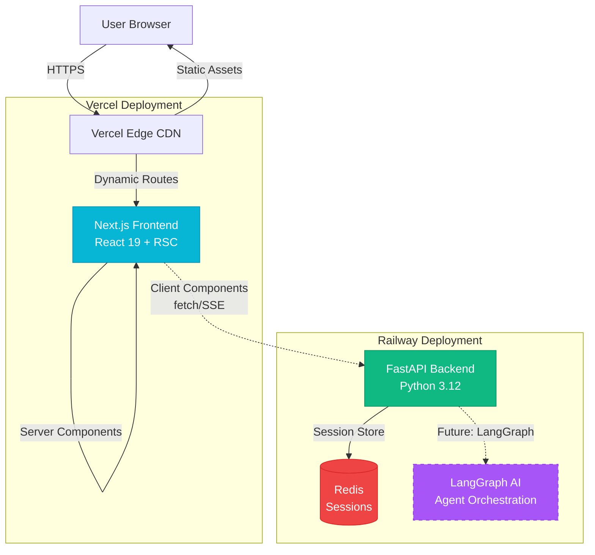

# 2. High Level Architecture

## 2.1 Technical Summary

OrchestratAI implements a **modern modular monolith architecture** deployed via Docker containers, featuring a Next.js 15 frontend with React Server Components and a FastAPI Python backend with modular service organization.

The system uses a **Server Components First** approach where initial page loads are server-rendered with subsequent interactions handled by client components, communicating with the backend through a type-safe API layer validated by Zod (frontend) and Pydantic (backend). The frontend and backend share a unified type system through synchronized TypeScript and Python enums, enforced by automated validation scripts in the CI/CD pipeline.

Infrastructure runs on **Docker Compose** for development with service networking between frontend (`orchestratai_client`), backend (`orchestratai_api`), and Redis containers, using Bun workspaces for monorepo management and enabling shared TypeScript types in a `packages/shared` directory.

The architecture demonstrates **production-ready design patterns** including a 3-layer CSS design token system (following the my_flow_app reference pattern), optimistic UI updates, and modular backend organization that's prepared for future LangGraph AI agent orchestration while currently using mock data for rapid MVP development.

---

## 2.2 Platform and Infrastructure Choice

**Platform:** Vercel (Frontend) + Railway (Backend) ⭐ **RECOMMENDED**

**Rationale:**
1. **Portfolio Focus**: Vercel deployment demonstrates modern Next.js best practices
2. **Speed**: Fastest time-to-deployment (< 1 hour setup)
3. **Developer Experience**: Automatic preview deployments for demos
4. **Cost**: Free tier perfect for portfolio/demo
5. **Scalability Path**: Easy upgrade when needed

**Platform Configuration:**

```yaml
Platform: Vercel (Frontend) + Railway (Backend)

Frontend Services:
  - Vercel Edge Network (global CDN)
  - Automatic HTTPS
  - Environment: Node.js 20+

Backend Services:
  - Railway Docker deployment
  - PostgreSQL addon (if needed later)
  - Redis addon (session management)

Deployment Regions:
  - Vercel: Global edge (automatic)
  - Railway: US-West (Oregon) or EU-West (Frankfurt)
```

**Key Services:**
- Vercel Edge CDN (global distribution)
- Railway Docker runtime (FastAPI backend)
- Railway Redis (session/cache storage)
- Railway PostgreSQL (future - persistent storage)

---

## 2.3 Repository Structure

**Structure:** Bun Workspaces Monorepo
**Monorepo Tool:** Bun native workspaces
**Package Organization:**

```yaml
Packages:
  - orchestratai_client: Next.js frontend application
  - orchestratai_api: FastAPI backend application
  - packages/shared: Shared TypeScript types/enums (TO CREATE)
  - packages/ui: Shared React components (OPTIONAL - Phase 5+)

Shared Code Strategy:
  - TypeScript types/interfaces → packages/shared/src/types/
  - Enums → packages/shared/src/enums/
  - Constants → packages/shared/src/constants/
  - Utils (if truly shared) → packages/shared/src/utils/
```

**Rationale:**
- Frontend imports from `@orchestratai/shared`
- Backend uses enum validation script to stay synchronized
- No code duplication for domain models
- Clear separation of concerns

---

## 2.4 High Level Architecture Diagram



---

## 2.5 Architectural Patterns

**Patterns guiding fullstack development:**

- **Jamstack Architecture:** Server-rendered Next.js with API routes and serverless edge functions - _Rationale:_ Optimal performance with Server Components for initial loads and client-side hydration for interactivity

- **Server Components First:** Default to React Server Components, use Client Components only when necessary (state, events, browser APIs) - _Rationale:_ Reduced bundle size, faster initial page loads, better SEO, aligns with Next.js 15 best practices

- **Modular Monolith (Backend):** Organized into `agents/`, `models/`, `services/` modules within single deployment - _Rationale:_ Simplicity of single deployment with architectural benefits of separation; ready for microservices extraction if needed

- **Backend for Frontend (BFF):** FastAPI serves as dedicated backend for Next.js frontend needs - _Rationale:_ Tailored API responses, handles aggregation and transformation specific to UI requirements

- **Type-Safe Contract:** Shared enums + Zod (FE) + Pydantic (BE) with automated synchronization - _Rationale:_ Compile-time and runtime type safety prevents API contract drift

- **Repository Pattern (Backend):** Abstract data access behind repository interfaces - _Rationale:_ Enables testing with mocks, future database changes, follows SOLID principles

- **Optimistic UI Updates:** Frontend shows immediate feedback before API confirmation - _Rationale:_ Perceived performance improvement, better UX during network latency

- **Three-Layer Design Tokens:** Primitives → Semantic → Component tokens in CSS - _Rationale:_ Consistent theming, maintainable styling, proven pattern from my_flow_app reference

- **Docker-First Development:** All development through containers with hot reload - _Rationale:_ Environment consistency, eliminates "works on my machine" issues

---
