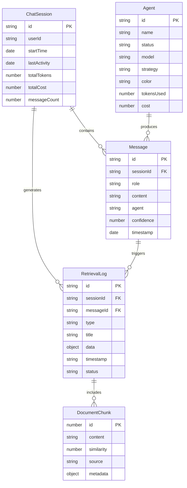

# 4. Data Models

Core data models shared between frontend (TypeScript) and backend (Python):

## 4.1 Agent

**Purpose:** Represents an AI agent in the multi-agent orchestration system

**TypeScript Interface:**
```typescript
// packages/shared/src/types/agent.ts
import { AgentId, AgentStatus, RetrievalStrategy, AgentColor } from '../enums';

export interface Agent {
  id: AgentId;
  name: string;
  status: AgentStatus;
  model: string;
  strategy?: RetrievalStrategy;
  color: AgentColor;
  tokensUsed: number;
  cost: number;
  cached?: boolean;
}
```

**Relationships:**
- An Agent produces Messages
- An Agent generates RetrievalLogs during processing
- Multiple Agents exist per ChatSession

---

## 4.2 Message

**Purpose:** Represents a single message in the chat conversation

**TypeScript Interface:**
```typescript
// packages/shared/src/types/message.ts
import { MessageRole, AgentId } from '../enums';

export interface Message {
  id: string; // UUID
  role: MessageRole;
  content: string;
  agent?: AgentId;
  confidence?: number; // 0.0 to 1.0
  timestamp: Date;
  sessionId: string; // UUID
}
```

**Relationships:**
- Messages belong to a ChatSession
- Assistant Messages reference an Agent
- Messages trigger RetrievalLogs

---

## 4.3 RetrievalLog

**Purpose:** Captures detailed logging of agent processing steps

**TypeScript Interface:**
```typescript
// packages/shared/src/types/retrieval-log.ts
import { LogType, LogStatus } from '../enums';
import { DocumentChunk } from './document-chunk';

export interface RetrievalLog {
  id: string; // UUID
  type: LogType;
  title: string;
  data: Record<string, any>;
  timestamp: string; // ISO 8601
  status: LogStatus;
  chunks?: DocumentChunk[];
  sessionId: string;
  messageId: string;
}
```

**Relationships:**
- RetrievalLogs belong to a ChatSession
- RetrievalLogs are triggered by a Message
- RetrievalLogs can contain DocumentChunks

---

## 4.4 DocumentChunk

**Purpose:** Represents a retrieved document fragment from vector search

**TypeScript Interface:**
```typescript
// packages/shared/src/types/document-chunk.ts
export interface DocumentChunk {
  id: number;
  content: string;
  similarity: number; // 0.0 to 1.0
  source: string;
  metadata?: Record<string, any>;
}
```

---

## 4.5 ChatSession

**Purpose:** Represents a user's conversation session

**TypeScript Interface:**
```typescript
// packages/shared/src/types/chat-session.ts
export interface ChatSession {
  id: string; // UUID
  userId?: string;
  startTime: Date;
  lastActivity: Date;
  totalTokens: number;
  totalCost: number;
  messageCount: number;
}
```

---

## 4.6 ChatMetrics

**Purpose:** Real-time metrics for a single chat interaction

**TypeScript Interface:**
```typescript
// packages/shared/src/types/chat-metrics.ts
export interface ChatMetrics {
  tokensUsed: number;
  cost: number; // USD
  latency: number; // milliseconds
}
```

---

## Data Model Relationships Diagram



---
