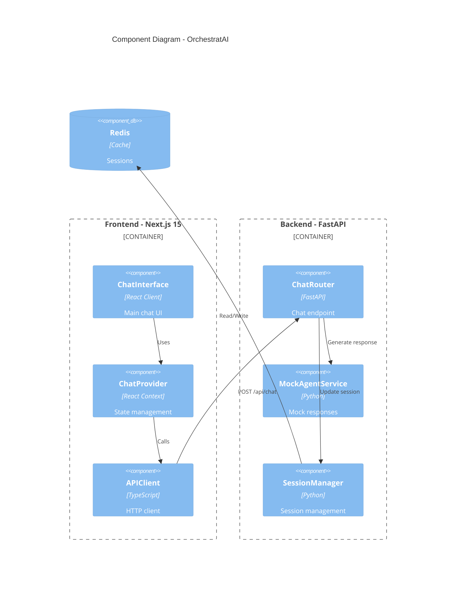

# 6. Components

Major logical components across the fullstack system:

## 6.1 Frontend Components

### ChatInterface
**Responsibility:** Main chat UI orchestrator
**Technology:** React Client Component
**Dependencies:** ChatProvider, APIClient, child UI components

### AgentPanel
**Responsibility:** Display real-time agent statuses
**Technology:** React Component (Server/Client hybrid)
**Dependencies:** ChatProvider, AgentCard components

### RetrievalPanel
**Responsibility:** Display retrieval logs with filtering
**Technology:** React Client Component
**Dependencies:** ChatProvider, LogCard components

### ChatProvider
**Responsibility:** Global state management for chat
**Technology:** React Context + useReducer
**Dependencies:** APIClient, localStorage

### APIClient
**Responsibility:** Type-safe HTTP client
**Technology:** TypeScript Class
**Dependencies:** Zod schemas, custom errors

---

## 6.2 Backend Components

### ChatRouter
**Responsibility:** FastAPI router for `/api/chat`
**Technology:** FastAPI APIRouter
**Dependencies:** MockAgentService, Pydantic schemas

### MockAgentService
**Responsibility:** Generate mock responses (MVP)
**Technology:** Pure Python functions
**Dependencies:** None

### SessionManager
**Responsibility:** Redis session management
**Technology:** Python class with redis-py
**Dependencies:** Redis client

---

## Component Interaction Diagram

---
