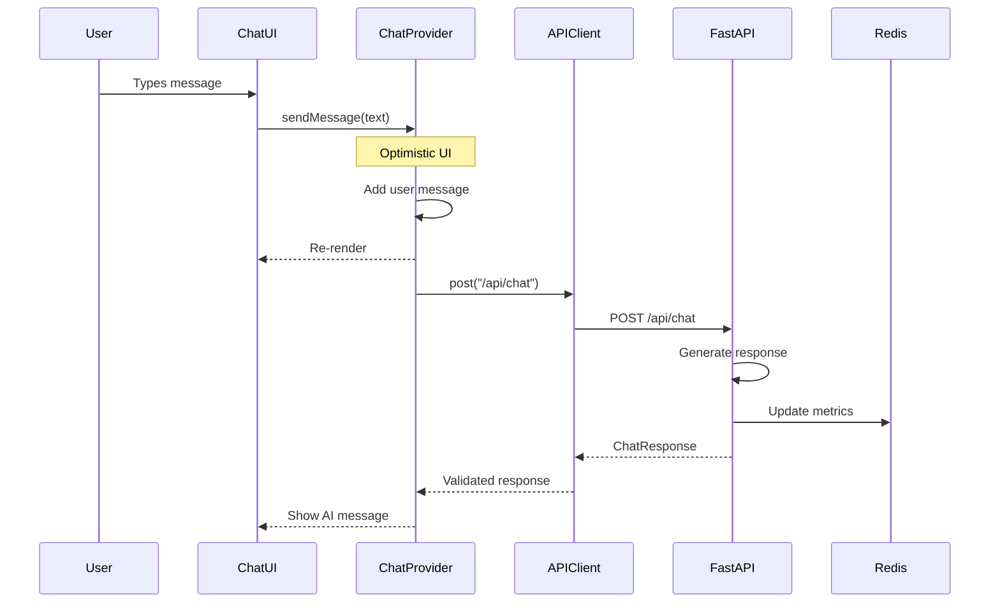
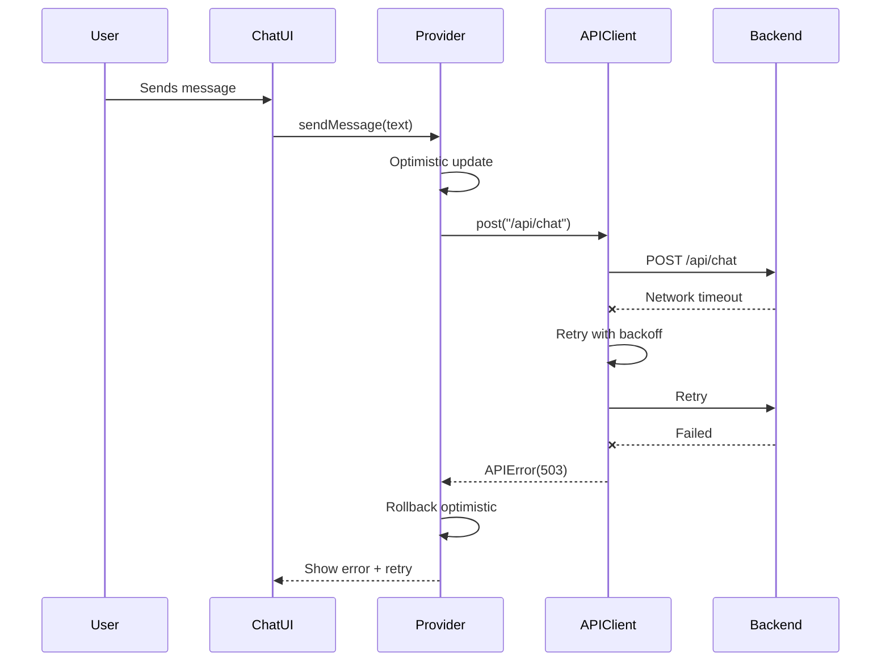

# 7. Core Workflows

Key system workflows illustrated with sequence diagrams.

## 7.1 Send Message - Happy Path

```mermaid
sequenceDiagram
    participant User
    participant ChatUI
    participant Provider as ChatProvider
    participant APIClient
    participant Backend as FastAPI
    participant Redis

    User->>ChatUI: Types message
    ChatUI->>Provider: sendMessage(text)

    Note over Provider: Optimistic UI
    Provider->>Provider: Add user message
    Provider-->>ChatUI: Re-render

    Provider->>APIClient: post("/api/chat")
    APIClient->>Backend: POST /api/chat
    Backend->>Backend: Generate response
    Backend->>Redis: Update metrics
    Backend-->>APIClient: ChatResponse
    APIClient-->>Provider: Validated response
    Provider-->>ChatUI: Show AI message
```

---

## 7.2 Error Handling - Network Failure

```mermaid
sequenceDiagram
    participant User
    participant ChatUI
    participant Provider
    participant APIClient
    participant Backend

    User->>ChatUI: Sends message
    ChatUI->>Provider: sendMessage(text)
    Provider->>Provider: Optimistic update
    Provider->>APIClient: post("/api/chat")
    APIClient->>Backend: POST /api/chat
    Backend--xAPIClient: Network timeout

    APIClient->>APIClient: Retry with backoff
    APIClient->>Backend: Retry
    Backend--xAPIClient: Failed

    APIClient-->>Provider: APIError(503)
    Provider->>Provider: Rollback optimistic
    Provider-->>ChatUI: Show error + retry
```

---
