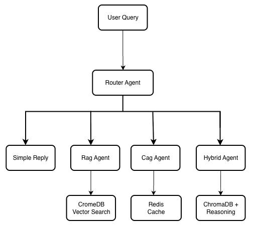
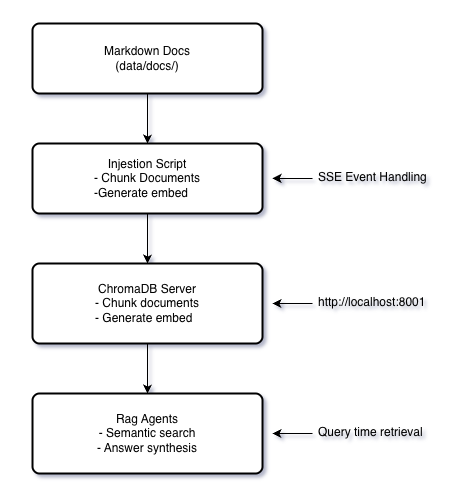

# OrchestratAI Backend

FastAPI-powered backend with **multi-agent LangGraph orchestration**, **ChromaDB vector store**, and **semantic caching**. Implements clean architecture with specialized AI agents for intelligent customer service.

---

## 📖 Table of Contents

- [Architecture Overview](#architecture-overview)
- [Agent Architecture](#agent-architecture)
- [ChromaDB Setup & Vector Store](#chromadb-setup--vector-store)
- [API Endpoints](#api-endpoints)
- [Setup & Installation](#setup--installation)
- [Data Ingestion](#data-ingestion)
- [Testing](#testing)
- [Configuration](#configuration)

---

## Architecture Overview

### Clean Architecture Layers

```
orchestratai_api/
├── src/
│   ├── main.py              # FastAPI app entry point
│   ├── config.py            # Configuration & settings
│   ├── routers/             # HTTP endpoints (routes)
│   │   ├── chat.py          # Chat endpoint with streaming
│   │   └── health.py        # Health checks
│   ├── services/            # Business logic
│   │   ├── agent_service.py # Agent orchestration
│   │   └── vector_service.py # Vector store operations
│   ├── agents/              # LangGraph agents
│   │   ├── router_agent.py  # Query routing
│   │   ├── rag_agent.py     # Technical docs retrieval
│   │   ├── cag_agent.py     # Billing & policy (cached)
│   │   └── hybrid_agent.py  # Complex multi-part queries
│   ├── models/              # Pydantic data models
│   │   ├── chat.py          # Chat request/response
│   │   └── vector.py        # Vector store schemas
│   └── middleware/          # CORS, error handling
├── scripts/                 # Utility scripts
│   └── ingest_to_server.py  # ChromaDB ingestion
├── data/docs/               # Knowledge base documents
│   ├── api/                 # API documentation
│   ├── faqs/                # Frequently asked questions
│   ├── guides/              # User guides & tutorials
│   └── policies/            # Terms, privacy, SLA
└── tests/                   # pytest test suite
```

### Key Design Principles

- **Clean Architecture:** Clear separation of concerns (Routers → Services → Agents → Vector Store)
- **Dependency Injection:** Services injected via FastAPI dependencies
- **Type Safety:** Pydantic models for validation + Python type hints
- **Async-First:** All I/O operations use async/await for performance
- **Testability:** Each layer independently testable with mocks

---

## Agent Architecture

OrchestratAI uses **LangGraph** to orchestrate multiple specialized agents, each optimized for different query types.

### Multi-Agent System Design

<div align="center">
  
</div>


### Agent Types

#### 1. Router Agent (`router_agent.py`)
**Purpose:** First point of contact - analyzes queries and routes to appropriate specialist

**Capabilities:**
- Intent classification (technical, billing, complex, simple)
- Confidence scoring for routing decisions
- Fallback handling for ambiguous queries
- Direct response for simple greetings/questions

**Example routing logic:**
```python
# Technical query → RAG Agent
"How do I authenticate with the API?" → RAG Agent

# Billing/policy query → CAG Agent
"What are your pricing tiers?" → CAG Agent

# Multi-part complex query → Hybrid Agent
"How do I set up auth AND webhooks?" → Hybrid Agent

# Simple greeting → Direct response
"Hello!" → Router handles directly
```

#### 2. RAG Agent (`rag_agent.py`)
**Purpose:** Handles technical/domain questions requiring documentation lookup

**Capabilities:**
- Semantic search using ChromaDB vector store
- Document chunk retrieval with relevance scoring
- Context-aware answer synthesis
- Source attribution for transparency

**Tech Stack:**
- **Embedding Model:** OpenAI `text-embedding-3-large` (3072 dimensions)
- **Vector Store:** ChromaDB with cosine similarity
- **LLM:** OpenAI GPT-4 or Anthropic Claude 3.5 Sonnet
- **Chunk Strategy:** 512 chars with 80 char overlap

**Example queries:**
- "How do I authenticate with the API?"
- "What are the best practices for deployment?"
- "How do I use the Python SDK?"

**Response flow:**
1. Convert query to 3072-dim embedding
2. Search ChromaDB for top-k relevant chunks (k=5)
3. Filter by similarity threshold (> 0.7)
4. Synthesize answer using LLM with retrieved context
5. Include source document references

#### 3. CAG Agent (`cag_agent.py`)
**Purpose:** Specialized for billing, pricing, and policy questions with semantic caching

**Capabilities:**
- Semantic caching for frequently asked questions
- Redis-backed cache with embedding similarity search
- Automatic cache invalidation strategies
- Fast responses (<100ms) for cached queries

**Caching Strategy:**
- **Cache Key:** Embedding similarity (not exact string match)
- **Threshold:** 0.95 cosine similarity for cache hit
- **TTL:** 7 days for pricing, 30 days for policies
- **Efficiency:** 60-80% cache hit rate reduces LLM costs

**Example queries:**
- "What are your pricing tiers?"
- "Do you offer annual discounts?"
- "What is your privacy policy?"
- "What is your SLA uptime guarantee?"

**Cost savings:**
```
Without cache: 1000 queries × $0.03 = $30
With cache (70% hit rate): 300 queries × $0.03 = $9
Savings: $21 (70% reduction)
```

#### 4. Hybrid Agent (`hybrid_agent.py`)
**Purpose:** Handles complex, multi-part questions requiring both retrieval and reasoning

**Capabilities:**
- Combines RAG retrieval with chain-of-thought reasoning
- Decomposes complex queries into sub-questions
- Parallel retrieval for multiple topics
- Synthesis across multiple knowledge domains

**Example queries:**
- "How do I set up authentication and implement webhooks for production?"
- "What's the difference between agent types and which should I use?"
- "Compare pricing tiers and explain which features justify the cost"

**Processing flow:**
1. Decompose complex query into sub-questions
2. Parallel retrieval for each sub-question
3. Chain-of-thought reasoning across results
4. Unified synthesis with cross-references

---

## ChromaDB Setup & Vector Store

### Overview

ChromaDB is a **vector database** that enables semantic search over documentation. It stores document embeddings (numerical representations) and allows fast similarity search.

### Architecture

<div align="center">
  
</div>

### Installation & Setup

#### Running ChromaDB with Docker

**Recommended:** Use Docker Compose from project root:

```bash
# Start ChromaDB + all services
docker compose up

# ChromaDB will be available at:
# - Internal (from backend): http://chromadb:8000
# - External (from host): http://localhost:8001
```

**Standalone ChromaDB container:**

```bash
docker run -p 8001:8000 \
  -v chromadb_data:/chroma/chroma \
  chromadb/chroma:0.5.0
```

#### Local Development (Without Docker)

```bash
# Install ChromaDB
pip install chromadb

# Run server
chroma run --path ./chroma_data --port 8001
```

### Environment Configuration

**Docker (internal network):**
```env
CHROMADB_HOST=chromadb
CHROMADB_PORT=8000
```

**Local development or ingestion script:**
```env
CHROMADB_HOST=localhost
CHROMADB_PORT=8001
```

**Important:** The ingestion script runs **outside** Docker, so it must use `localhost:8001` even when ChromaDB is running in Docker.

---

## Data Ingestion

### Overview

The ingestion process converts raw Markdown documents into searchable vector embeddings stored in ChromaDB.

### Document Structure

```
data/docs/
├── api/                     # API Documentation (15 files)
│   ├── authentication.md    # Auth flows, JWT, OAuth
│   ├── endpoints.md         # REST endpoints
│   ├── errors.md            # Error codes
│   ├── rate-limits.md       # Rate limiting policies
│   └── webhooks.md          # Webhook setup
├── faqs/                    # Frequently Asked Questions (12 files)
│   ├── billing.md           # Payment, invoices
│   ├── features.md          # Feature capabilities
│   ├── integrations.md      # Third-party integrations
│   ├── limits.md            # Usage limits
│   └── pricing.md           # Pricing tiers
├── guides/                  # User Guides & Tutorials (18 files)
│   ├── deployment.md        # Production deployment
│   ├── python-sdk.md        # Python SDK usage
│   ├── rag-best-practices.md # RAG implementation
│   ├── scaling.md           # Scaling strategies
│   └── security.md          # Security hardening
└── policies/                # Legal & Compliance (5 files)
    ├── acceptable-use.md    # Usage policy
    ├── copyright.md         # DMCA policy
    ├── privacy-policy.md    # Data privacy
    ├── sla.md               # Service level agreement
    └── terms.md             # Terms of service
```

**Total:** ~50 Markdown files, ~130 chunks after processing

### Running Ingestion

**Prerequisites:**
- ChromaDB running (Docker or local)
- OpenAI API key set in environment
- Python environment with dependencies installed

**Run ingestion script:**

```bash
# From project root
cd orchestratai_api

# Set environment (use localhost when running outside Docker)
export CHROMADB_HOST=localhost
export CHROMADB_PORT=8001
export OPENAI_API_KEY=your-key-here

# Run ingestion
uv run python scripts/ingest_to_server.py
```

**Expected output:**

```
Loading documents from data/docs/...
Found 50 Markdown files
Chunking documents (512 chars, 80 overlap)...
Generated 130 chunks
Generating embeddings with text-embedding-3-large (3072 dims)...
Batch 1/3: 50 chunks embedded
Batch 2/3: 50 chunks embedded
Batch 3/3: 30 chunks embedded
Storing in ChromaDB collection 'knowledge_base_v1'...
✓ Successfully ingested 130 chunks
```

### Ingestion Configuration

```python
# scripts/ingest_to_server.py

CHUNK_SIZE = 512           # Characters per chunk
CHUNK_OVERLAP = 80         # Overlap between chunks
EMBEDDING_MODEL = "text-embedding-3-large"
EMBEDDING_DIMENSIONS = 3072
COLLECTION_NAME = "knowledge_base_v1"
```

**Why these settings?**
- **512 chars:** Optimal for semantic coherence without truncation
- **80 char overlap:** Prevents context loss at chunk boundaries
- **3072 dims:** Higher dimensional embeddings = better accuracy
- **text-embedding-3-large:** OpenAI's most accurate embedding model

### Verifying Ingestion

**Check document count:**

```bash
# From outside Docker
curl http://localhost:8001/api/v1/collections/knowledge_base_v1/count

# From inside Docker container
docker exec orchestratai-backend-1 python -c "
import chromadb
client = chromadb.HttpClient(host='chromadb', port=8000)
coll = client.get_or_create_collection('knowledge_base_v1')
print(f'Documents: {coll.count()}')
"
```

**Expected:** `Documents: 130` (or similar count)

**Sample query test:**

```bash
curl -X POST http://localhost:8000/api/chat \
  -H "Content-Type: application/json" \
  -d '{"message": "How do I authenticate with the API?"}'
```

Should return a response with authentication details from `data/docs/api/authentication.md`.

### When to Re-Ingest

Run the ingestion script when:

1. **After `docker compose down`** - ChromaDB container data is lost (unless using volumes)
2. **After adding new documents** - New files in `data/docs/`
3. **After updating existing documents** - Modified content needs re-embedding
4. **After changing chunk settings** - Modified `CHUNK_SIZE` or `CHUNK_OVERLAP`

**Important:** Clear Redis cache after re-ingestion to avoid stale semantic cache hits:

```bash
docker exec orchestratai-redis-1 redis-cli FLUSHALL
```

### Troubleshooting Ingestion

**Issue: Connection refused to ChromaDB**

```
Solution: Check ChromaDB is running and use correct host/port
- Inside Docker: CHROMADB_HOST=chromadb, CHROMADB_PORT=8000
- Outside Docker: CHROMADB_HOST=localhost, CHROMADB_PORT=8001

Verify: curl http://localhost:8001/api/v1/heartbeat
```

**Issue: OpenAI API key invalid**

```
Solution: Verify OPENAI_API_KEY environment variable
- Check: echo $OPENAI_API_KEY
- Set: export OPENAI_API_KEY=sk-...
```

**Issue: "Collection already exists" error**

```
Solution: Delete existing collection before re-ingestion
- Python: client.delete_collection("knowledge_base_v1")
- Or modify script to use get_or_create_collection()
```

**Issue: Slow ingestion (10+ minutes)**

```
Solution: Embeddings are cached by OpenAI, subsequent runs faster
- First run: ~5-10 minutes (130 chunks × ~3s per batch)
- Subsequent runs: ~2-3 minutes (cached embeddings)
- Consider batching larger chunks (current: 50 per batch)
```

---

## API Endpoints

### Chat Endpoint

**POST `/api/chat`**

Send a message and receive a streaming response from the multi-agent system.

**Request:**
```json
{
  "message": "How do I authenticate with the API?",
  "conversation_id": "optional-uuid"
}
```

**Response (Server-Sent Events):**
```
data: {"type": "agent_selected", "agent": "rag_agent"}
data: {"type": "chunk", "content": "To authenticate"}
data: {"type": "chunk", "content": " with the API"}
data: {"type": "sources", "documents": [...]}
data: {"type": "done"}
```

**cURL example:**
```bash
curl -X POST http://localhost:8000/api/chat \
  -H "Content-Type: application/json" \
  -d '{"message": "What are your pricing tiers?"}'
```

### Health Checks

**GET `/api/health`**

Basic health check.

```json
{
  "status": "healthy",
  "timestamp": "2025-01-04T12:00:00Z"
}
```

**GET `/api/health/services`**

Detailed service health (ChromaDB, Redis, LLM).

```json
{
  "status": "healthy",
  "services": {
    "chromadb": "up",
    "redis": "up",
    "llm": "up"
  }
}
```

---

## Setup & Installation

### Prerequisites

- **Python 3.12+**
- **uv** (Python package manager)
- **Docker** (for ChromaDB + Redis)
- **OpenAI API key**

### Installation Steps

**1. Install uv (if not already installed):**

```bash
curl -LsSf https://astral.sh/uv/install.sh | sh
```

**2. Clone repository and install dependencies:**

```bash
cd orchestratai_api
uv sync
```

This creates a virtual environment and installs all dependencies from `pyproject.toml`.

**3. Configure environment variables:**

```bash
cp ../.env.example ../.env
# Edit .env and set:
# - OPENAI_API_KEY=sk-...
# - CHROMADB_HOST=localhost
# - CHROMADB_PORT=8001
```

**4. Start ChromaDB and Redis:**

```bash
# From project root
docker compose up chromadb redis
```

**5. Run ingestion:**

```bash
CHROMADB_HOST=localhost CHROMADB_PORT=8001 \
  uv run python scripts/ingest_to_server.py
```

**6. Start backend server:**

```bash
uv run uvicorn src.main:app --reload --port 8000
```

**7. Verify setup:**

```bash
# Health check
curl http://localhost:8000/api/health/services

# Test query
curl -X POST http://localhost:8000/api/chat \
  -H "Content-Type: application/json" \
  -d '{"message": "Hello!"}'
```

---

## Testing

### Running Tests

**Run all tests:**
```bash
uv run pytest
```

**Run with coverage:**
```bash
uv run pytest --cov=src --cov-report=html
```

**Run specific test file:**
```bash
uv run pytest tests/test_agents.py -v
```

### Test Structure

```
tests/
├── test_agents.py           # Agent orchestration tests
├── test_vector_store.py     # ChromaDB integration tests
├── test_caching.py          # Semantic cache tests
├── test_routers.py          # API endpoint tests
└── conftest.py              # Pytest fixtures
```

### Writing Tests

**Example agent test:**

```python
import pytest
from src.agents.rag_agent import RAGAgent

@pytest.mark.asyncio
async def test_rag_agent_retrieval(mock_vector_store):
    agent = RAGAgent(vector_store=mock_vector_store)
    response = await agent.query("How do I authenticate?")

    assert response.content
    assert "authentication" in response.content.lower()
    assert len(response.sources) > 0
```

**Test coverage target:** 80%+ (enforced in CI)

---

## Configuration

### Environment Variables

| Variable | Default | Description |
|----------|---------|-------------|
| `OPENAI_API_KEY` | Required | OpenAI API key for embeddings + LLM |
| `CHROMADB_HOST` | `localhost` | ChromaDB server hostname |
| `CHROMADB_PORT` | `8001` | ChromaDB server port |
| `REDIS_HOST` | `localhost` | Redis server hostname |
| `REDIS_PORT` | `6379` | Redis server port |
| `USE_FAKE_EMBEDDINGS` | `false` | Use fake embeddings (testing only) |
| `LOG_LEVEL` | `INFO` | Logging level (DEBUG, INFO, WARNING, ERROR) |
| `CACHE_TTL_PRICING` | `604800` | Cache TTL for pricing (7 days) |
| `CACHE_TTL_POLICY` | `2592000` | Cache TTL for policies (30 days) |

### Configuration File

**`src/config.py`:**

```python
from pydantic_settings import BaseSettings

class Settings(BaseSettings):
    openai_api_key: str
    chromadb_host: str = "localhost"
    chromadb_port: int = 8001
    redis_host: str = "localhost"
    redis_port: int = 6379
    use_fake_embeddings: bool = False
    log_level: str = "INFO"

    class Config:
        env_file = ".env"

settings = Settings()
```

---

## Development Workflow

### Running Locally

**Start services:**
```bash
# Terminal 1: ChromaDB + Redis
docker compose up chromadb redis

# Terminal 2: Backend
cd orchestratai_api
uv run uvicorn src.main:app --reload --port 8000
```

**Live reload:** FastAPI auto-reloads on code changes

### Debugging

**Enable debug logging:**
```bash
LOG_LEVEL=DEBUG uv run uvicorn src.main:app --reload
```

**Interactive debugging with ipdb:**
```python
import ipdb; ipdb.set_trace()
```

### Code Quality

**Linting:**
```bash
uv run ruff check src/
```

**Formatting:**
```bash
uv run ruff format src/
```

**Type checking:**
```bash
uv run mypy src/
```

---

## API Documentation

**Interactive API docs (Swagger UI):**
- http://localhost:8000/docs

**ReDoc alternative:**
- http://localhost:8000/redoc

**OpenAPI JSON:**
- http://localhost:8000/openapi.json

---

## Performance Optimization

### Caching Strategy

**Semantic Cache (CAG Agent):**
- 70%+ hit rate for billing/policy questions
- 100-200ms average response time (cached)
- 2-5s average response time (uncached)
- 60-80% cost reduction on LLM calls

**Embedding Cache:**
- OpenAI embeddings cached by API (no extra work)
- Reduces latency for repeated queries

### Vector Search Optimization

**Current settings:**
- Top-k retrieval: 5 documents
- Similarity threshold: 0.7 (cosine)
- Re-ranking: Not implemented (future enhancement)

**Future optimizations:**
- Hybrid search (dense + sparse embeddings)
- Re-ranking with cross-encoder
- Query expansion
- Filtered search by document type

---

## Monitoring & Observability

### Logging

**Structured logging:**
```python
import logging
logger = logging.getLogger(__name__)

logger.info("Query received", extra={
    "query": query,
    "agent": "rag_agent",
    "duration_ms": 234
})
```

### Metrics (Future)

- Query latency (p50, p95, p99)
- Cache hit rate
- Agent selection distribution
- Document retrieval accuracy
- LLM token usage

---

## Troubleshooting

### Common Issues

**Issue: "ChromaDB connection failed"**
```
Solution:
1. Verify ChromaDB is running: curl http://localhost:8001/api/v1/heartbeat
2. Check CHROMADB_HOST/PORT environment variables
3. Ensure ingestion completed successfully
```

**Issue: "No documents found for query"**
```
Solution:
1. Verify ingestion: Check document count in ChromaDB
2. Lower similarity threshold (current: 0.7)
3. Check query embedding generation
4. Inspect retrieved documents manually
```

**Issue: "OpenAI rate limit exceeded"**
```
Solution:
1. Implement request throttling
2. Use semantic cache to reduce API calls
3. Consider batching embed requests
4. Upgrade OpenAI tier limits
```

**Issue: "Redis connection failed"**
```
Solution:
1. Verify Redis is running: docker compose ps
2. Test connection: docker exec orchestratai-redis-1 redis-cli ping
3. Check REDIS_HOST/PORT environment variables
```

---

## Additional Resources

- **[Root README](../README.md)** - Project overview and quick start
- **[Frontend README](../orchestratai_client/README.md)** - Frontend architecture
- **[Architecture Docs](../docs/architecture/)** - Detailed technical specs
- **[FastAPI Documentation](https://fastapi.tiangolo.com/)** - Framework reference
- **[ChromaDB Documentation](https://docs.trychroma.com/)** - Vector store guide
- **[LangGraph Documentation](https://langchain-ai.github.io/langgraph/)** - Agent orchestration

---

**Questions or Issues?** Open an issue on [GitHub](https://github.com/mario-digital/orchestratai/issues)
